# GTHA Transit

[Regional fleet research and remaining coverage](docs/vehicles/regional-research.md) records source-backed manufacturer, model and year additions without claiming complete live or photo coverage.

An independent journey planner for Greater Toronto and Hamilton, with cross-agency schedules, walking connections, and official TTC subway and light rail alerts.

**Public address:** [toronto-transit.org](https://toronto-transit.org). Domain and tunnel routing are configured separately by the owner. The live frontend reports its exact build revision and Toronto update time above the workspace.

The [travel-time controls](docs/planning/travel-time.md) separate Date and Time, preserve Toronto clock-change semantics, and offer explicit departure/arrival choices. Current deployment and the bounded browser verification are recorded in the [handoff](HANDOFF.md).

## What it looks like

Every picture below is the real built interface at commit `92153d6`, photographed
through an isolated headless browser as part of the interaction ledger, which
captures the surface after every one of its 56 clicks. They are copied out by
`scripts/ui-evidence/publish-captures.mjs`, which selects by the name the ledger
recorded and refuses any file whose bytes do not match the hash the ledger holds
for it. None is a mockup and none is hand-edited.

There is also a [walkthrough recording](docs/captures/walkthrough-92153d6.webm),
committed here rather than linked to a service that can disappear. It is 294 frames
of the real application at that same commit: arriving on the composer, planning with
a published place, preferring a garage and expanding it, looking at what the network
is doing, finding a vehicle, asking which garage it lives at, reading the service
record, and changing the appearance. Its provenance is in
[walkthrough.json](docs/captures/walkthrough.json).

It records the page and never the screen. Frames come from the renderer through the
debugging protocol, on an off-screen desktop, so nothing that happened to be on a
monitor is in it.

<details><summary>Planning a trip</summary>

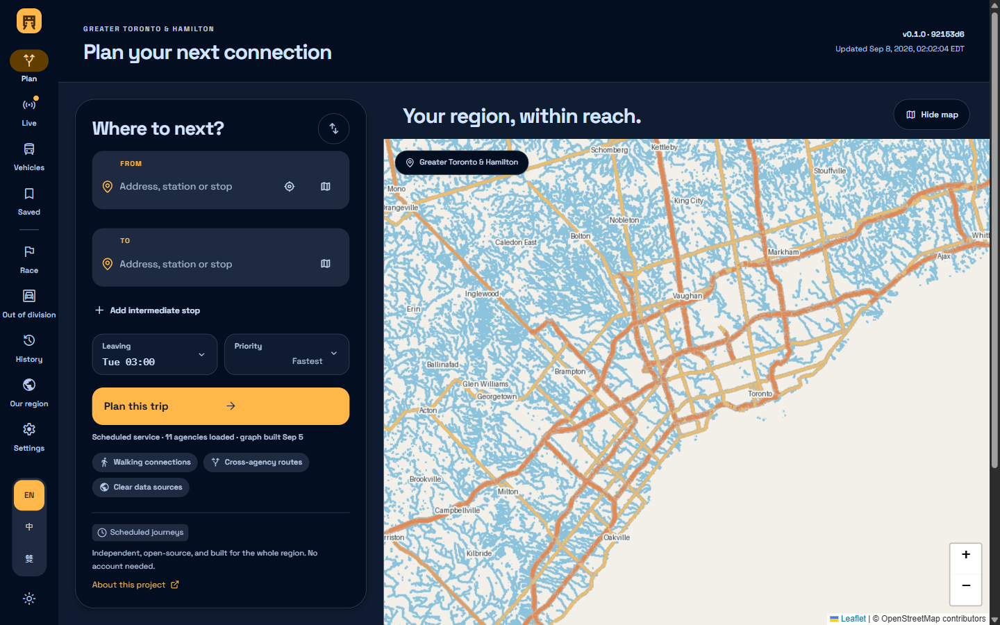

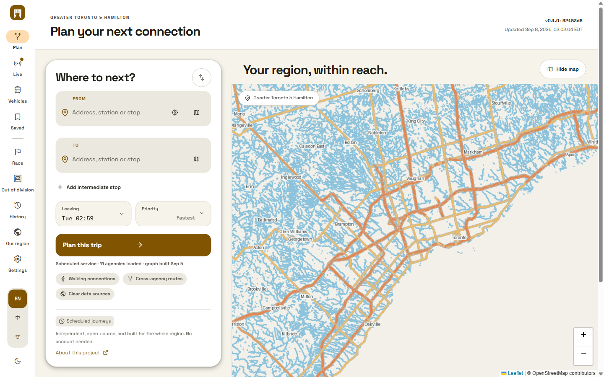

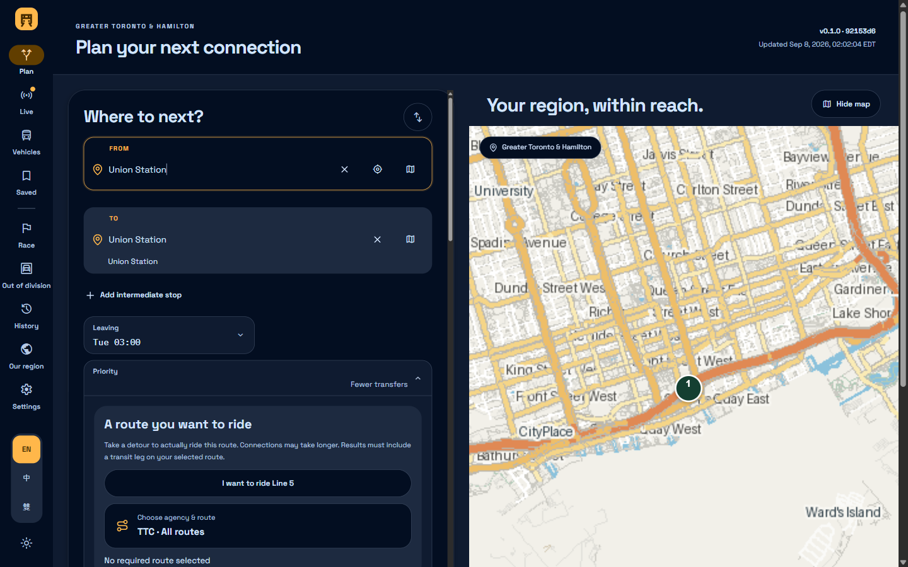

</details>

<details><summary>Watching the network</summary>

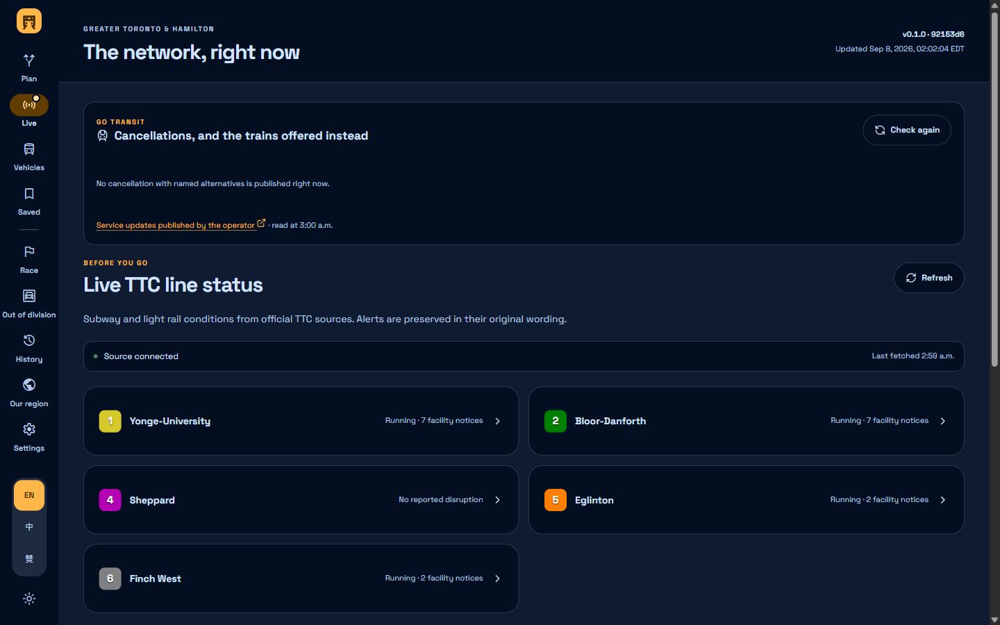

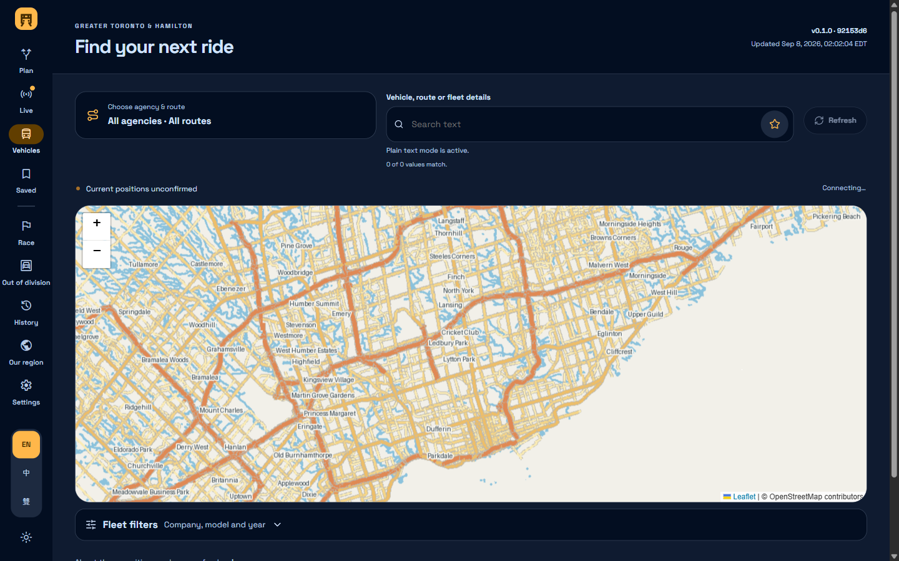

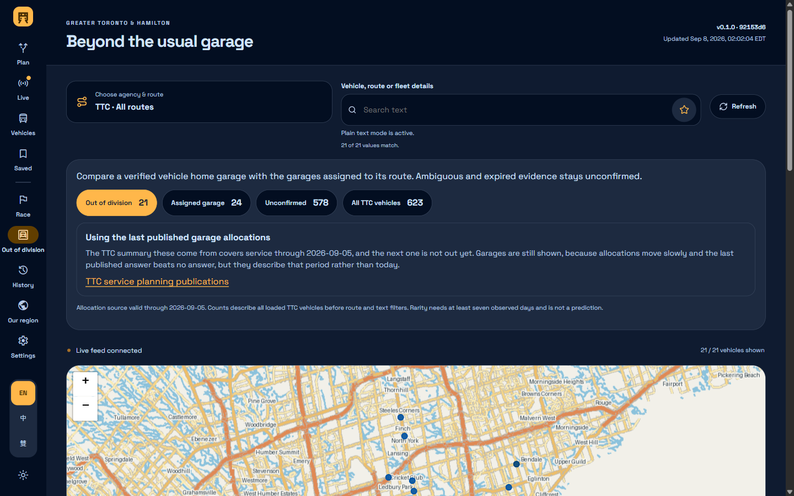

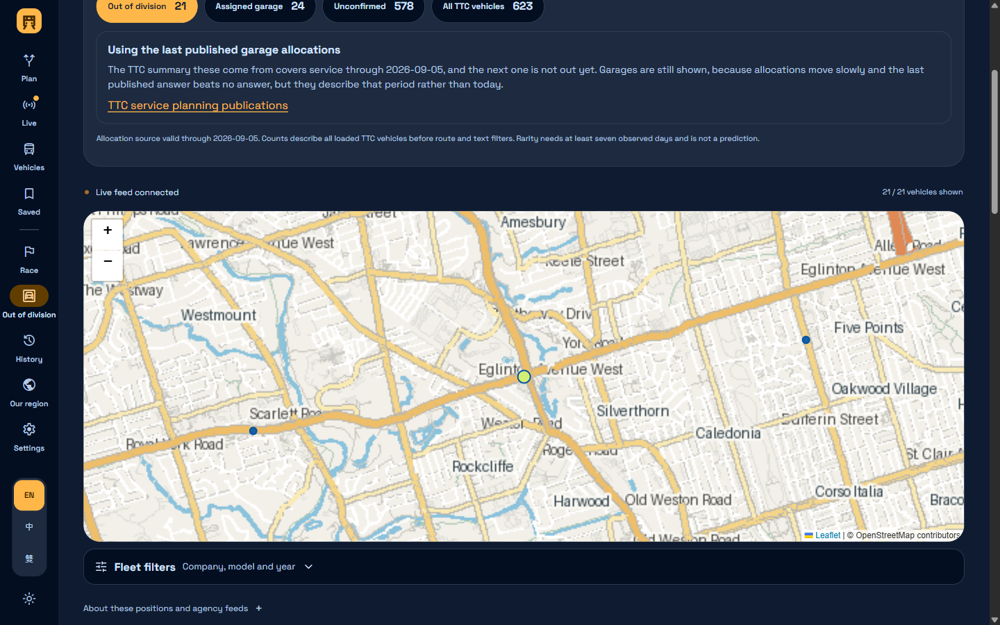

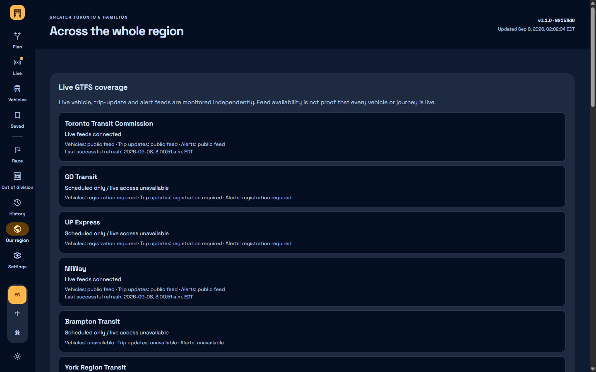

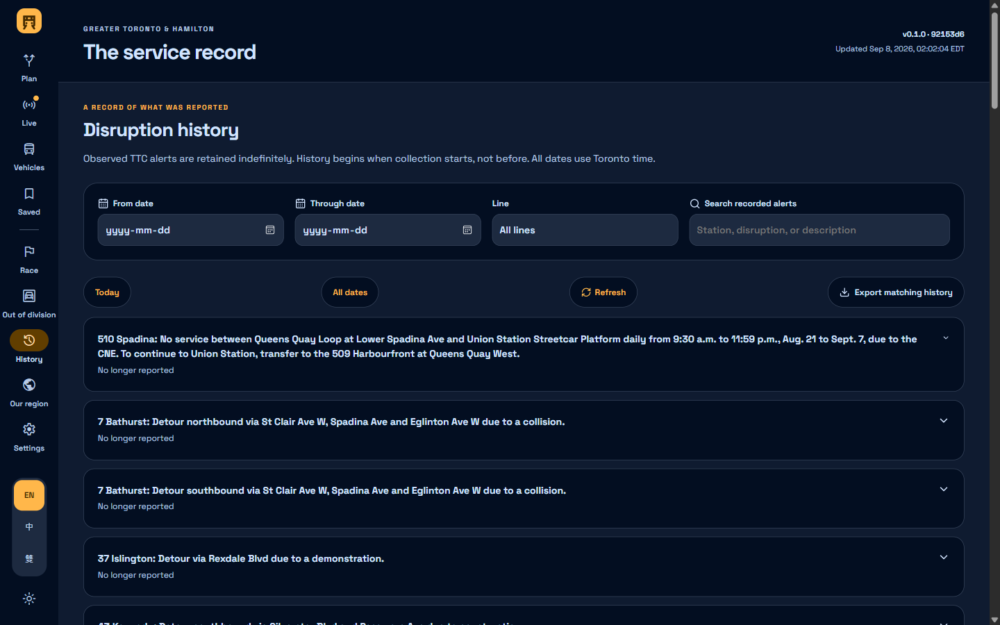

</details>

<details><summary>Racing, saving, settling in</summary>

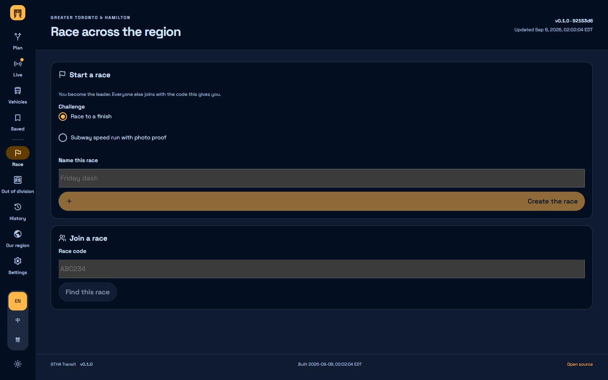

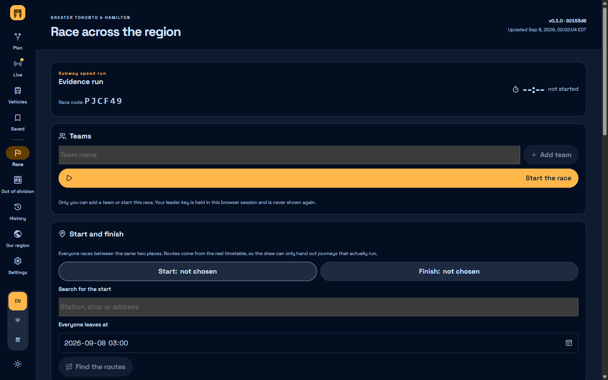

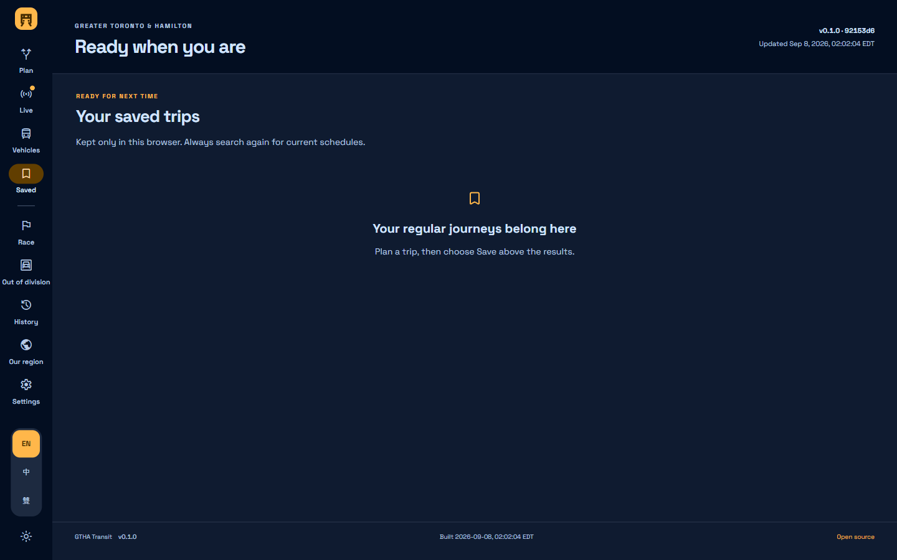

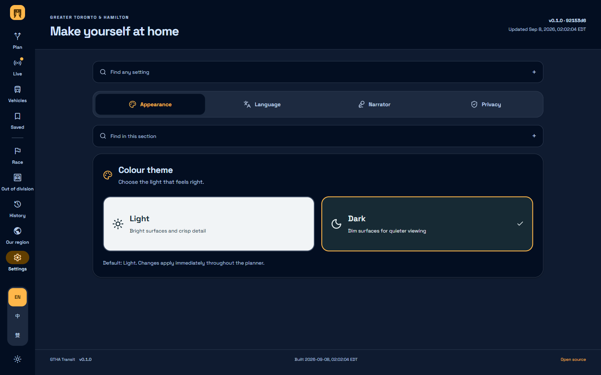

</details>

<details><summary>On a phone</summary>

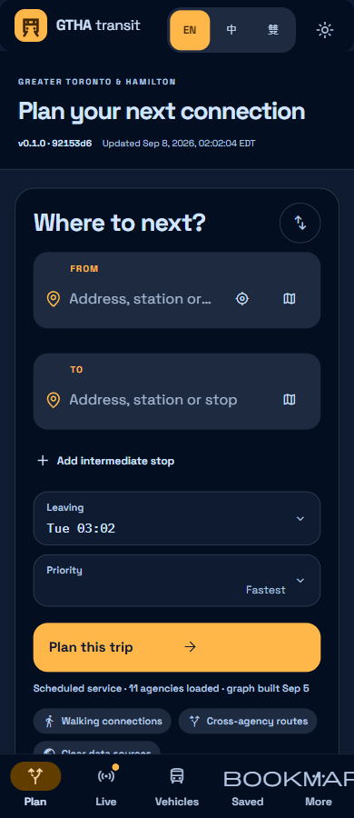

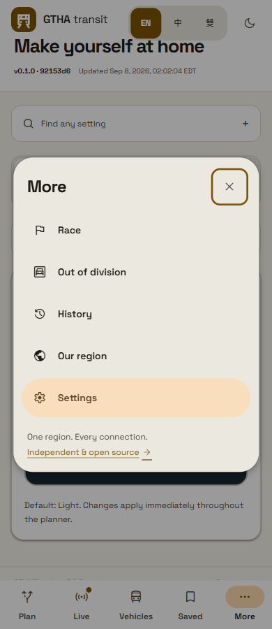

</details>

## Run locally

```powershell
.\build.bat --run
```

The web frontend is a static export built using the Sites scaffold. The production HTTP service uses Node built-ins and runs in a container. The routing engine and map service run separately. There is no desktop installer.

```sh
npm ci
npm run build
npm start
```

Set `ROUTING_ORIGIN` and `MAPS_ORIGIN` to the private services. Without validated transit feeds and a built routing graph, journey search reports unavailable rather than fabricating results. See [data/API documentation](docs/data/API.md), [TTC status](docs/status/README.md), and [deployment](docs/deployment/README.md).

<details><summary>Passenger features</summary>

- Search places and transit stops or select coordinates on the map.
- Use [dedicated workspaces](docs/interface/workspaces.md) with desktop side navigation and compact phone navigation; the journey composer stays on Plan while the tracker receives the full available width.
- Plan departure-time or arrival-time journeys across agency boundaries.
- Compare duration, transfers, walking, agencies, boarding points, intermediate stops and arrival times.
- View official TTC subway and light rail alerts, with receipt freshness separate from publisher update time.
- Save trips in browser storage, reverse a trip, search earlier/later, share endpoints explicitly and export the itinerary as JSON.
- Use English, Cantonese or bilingual presentation and light/dark appearance.
- Adjust [Appearance, Language, Narrator and Privacy](docs/interface/settings.md) through focused settings sections, with independent tone controls and search that leads directly to a setting.
- Browse indefinitely retained disruption history with calendar filters and exports.
- Track live TTC, GO, UP, MiWay, Burlington and HSR vehicles on a map.
- Inspect verified manufacturer/model/build-year data, CPTDB references and attributed fleet photos.
- See a currently assigned vehicle inside directions when a fresh exact-trip match exists.
- Prefer confirmed transit-facility washrooms, and divert to verified municipal facilities when published hours support arrival-time availability.
- Read actual feed coverage and calendar ranges before relying on a journey.
- Compare first-service and transfer waiting times for each returned departure option.
- Choose an optional [spoken narrator](docs/accessibility/narrator.md), with independent English and Cantonese voices, preview, rate, pitch and quiet controls.
- Set [manufacturer, model and build-year preferences or avoidance](docs/planning/vehicle-preferences.md) using verified current assignments, with explicit handling of unknown vehicles.
- Open the [advanced regular-expression workbench](docs/search/regex-builder.md) using the compact star beside each vehicle, agency, route, manufacturer and model search field.

Accessibility attributes reflect available data, not a guarantee of elevator availability. Planned service does not automatically incorporate unplanned disruptions. Fares and specialized transit bookings are not calculated.
</details>

<details><summary>Data, privacy and independence</summary>

TTC, GO Transit, UP Express, MiWay, Brampton Transit, YRT, Durham Region Transit, Oakville Transit, Burlington Transit, Milton Transit and HSR are the explicit coverage target. Loaded data and service calendars determine actual availability.

OpenStreetMap data is © OpenStreetMap contributors and licensed under the ODbL. Transit data remains subject to each publisher's licence. This project is not affiliated with TTC, Metrolinx, Triplinx or another transit agency.

No account or analytics is required. Saved trips and settings stay in the browser. Search coordinates are processed by the regional service without request-body logging. Share links contain both endpoint locations. Keep private deployment addresses and credentials outside this repository.
</details>

<details><summary>Development and verification</summary>

Run `npm run typecheck` and `npm test` locally. The static frontend production build is `npm run build`. The container build is `docker compose build` after setting the documented deployment variables.

See [ROADMAP.md](ROADMAP.md) and [HANDOFF.md](HANDOFF.md) for the current verified state. Public regional routing, vehicle maps, photos, history and phone-width bilingual layouts have been exercised. Physical-device testing and unsupported agency live-feed access are not claimed. Publisher schedule-calendar gaps are exposed directly in the planner.

The current user-approved release scope is a browser transit planner. Unrelated universal utilities and desktop packaging are explicitly deferred. This is a functional journey-planning surface, not an advertisement for an unbuilt desktop product.
</details>
