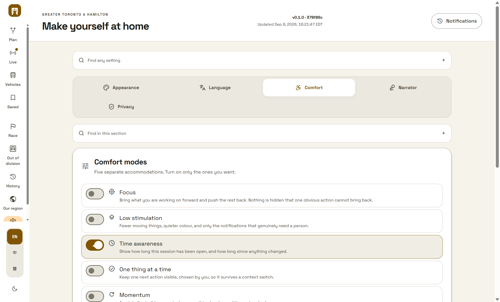

# Comfort modes and your own wording

Two settings that make the planner fit the person rather than the other way
round. Both are entirely local, and neither is on until somebody turns it on.

## The five modes

Modes, plural, and each switched on by itself. Attention difficulties do not
arrive as a single setting: somebody may want the interface quieter without
wanting time nudges, or want time nudges *because* they are hyperfocusing and
want interrupting. Bundling them into one switch means most people turn the whole
thing off to escape the one part that does not suit them.

| Mode | What it does |
| --- | --- |
| **Focus** | Brings what you are working on forward and pushes the rest back. |
| **Low stimulation** | Fewer moving things, quieter colour, fewer notifications. |
| **Time awareness** | How long this session has been open, and how long since anything changed. |
| **One thing at a time** | Keeps one next action visible, chosen by you. |
| **Momentum** | A quiet, dismissible prompt when something has been sitting untouched. |

**All five ship off.** These are accommodations, not an opinion about how anybody
should work, and a mode that switches itself on has decided something about the
person it has no standing to decide.

They are named for what they **do**, so somebody can use one without disclosing
anything about themselves to a colleague reading over their shoulder. Nothing here
is medical: no diagnosis, no assessment, no advice, no claim of benefit. A guard
reads the copy the interface actually shows and refuses clinical wording in it.

### What each one is careful about

**Focus never removes anything.** It dims and de-emphasises, and everything it
quietens comes back on hover or focus. An interface that disappears work is a
worse problem than a busy one, so there is no `display: none` anywhere in it.

**Low stimulation stops motion rather than slowing it.** A slow animation is still
motion, which is the thing being asked for less of. It composes with the
platform's own reduced-motion preference and never overrides it: somebody who has
already asked the operating system for less has asked once.

**Time awareness states a number and never a judgement.** Time blindness is one of
the most consistently reported difficulties and almost no software helps with it.
Saying "this session has been open 90 minutes" is the whole feature. Nagging about
it is not.

**The one thing is yours.** It is not inferred from what you were doing; you type
it. It rides on the shell, so it survives moving between destinations.

**Momentum respects a "not now" for half an hour**, not for thirty seconds. It
speaks only when the surface has genuinely been still for twenty minutes, and it
says what is true — "nothing has changed here for 24 minutes" — never what you
should feel about it.

There are no streaks, no scores, no congratulations and no days ranked against
each other. A second guard reads the shown copy and refuses those too.

## Your own wording

Point the planner at a JSON file of your words and the interface uses them instead
of ours. The feature is defined by what it will not do.

**Nothing ships with it.** No built-in mappings, no samples, no templates, no
defaults. Until a valid file is supplied, every surface renders the wording it
shipped with. The control is always visible so it can be found; the format panel
shows the shape with nothing in it, because a sample vocabulary here would be this
planner shipping words nobody asked for.

**It never leaves this browser.** No network request, no telemetry, no log, and it
is never included in an export.

**A rejected file applies nothing** — not partially, not the entries before the bad
one. A vocabulary half-applied is an interface speaking two vocabularies at once
with no way to tell which words are whose.

### The file

```json
{ "version": 1, "entries": [ { "term": "", "replacement": "" } ] }
```

At most 400 entries and 64 KB. Every bound is checked over the complete byte
payload before a single word is displayed, and every refusal is named: too large,
not JSON, unsupported version, too many entries, a term that is blank, too long,
duplicated, or a field this planner does not know. "That file did not work" is not
something a person can act on.

A term is matched as a **whole word**, so renaming `stop` does not rename
`stopwatch` or `nonstop`. A longer phrase wins over a shorter term inside it. The
original capitalisation is kept, so a term at the start of a sentence stays
capitalised. Regex punctuation in a term is matched literally.

### Where it applies

At `t`, the single boundary every piece of copy in the planner passes through, and
after the language mode and the playfulness level have chosen the sentence — so it
renames what is actually shown. Applied at each call site instead, a replacement
would reach some surfaces and not others.

Commands, addresses, route numbers, identifiers and official notices keep their
own words: a person who renames "station" has not renamed a station id.

The cache is read back through **the same reader the file picker uses**, so a value
edited by hand, truncated by a storage bound or written by an older version cannot
reach the interface by a shorter path.

## Where to find them

The **Comfort** tab in settings. Every mode and the vocabulary control are in the
settings catalog, so they are reachable from the settings search and from the
command palette. The palette knows the words people actually type: searching
`adhd` finds all five modes, though none of them is called that.

## Captured from the built artifact

| | |
| --- | --- |
| Commit | `378f89c13e85b6769d7c072ab03c8f6903531f78` |
| Viewport | 1440 x 900, scale 1 |
| SHA-256 | `9e60224784849b92f4398b22b200894af1cf29e39e6a2fb3f9d1af49ca9ca917` |



## Verification

`tests/adhd-vocabulary.test.mjs`, plus 22 checks against the running build through
`scripts/ui-evidence/drive-comfort.mjs`. The driver hands a real file to the real
picker and confirms in a browser that the renamed word changes on screen, that
clearing restores the original immediately, and that a file the reader refuses is
refused in words and applies nothing.

Six boundaries were broken on purpose and
watched go red: a mode shipping switched on, a "not now" stopping being respected,
the vocabulary no longer applied at the text boundary, focus removing things
instead of quietening them, the format panel shipping a sample vocabulary, and the
cache being trusted rather than revalidated.

Two of those checks were weak on their first run and the break test is what showed
it. The copy guards scanned the whole file and so matched the comments *stating*
the rules; they read the displayed strings now, with interpolated expressions
stripped, because `${elapsedMinutes(adhd, now)}` was reporting the session clock as
clinical language. And the snooze check passed for the wrong reason, since
snoozing also resets the idle clock — it is asserted at a moment when the surface
has been still long enough for momentum to speak, and does not.

## What is not done

- Focus dims the navigation, the status rail and the footer. It does not yet
  spotlight within a destination.
- Low stimulation stops motion and hides the live badge. It does not yet reduce
  which notifications are raised.
- The captures cover 1440 in one theme. Narrow widths and higher display scales
  are unverified.
