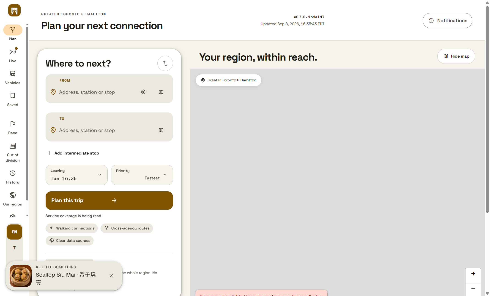

# The dim sum surprise

One launch in ten shows a dim sum dish: its name in both languages, and a
picture of it. That is the whole feature.

## There is no setting for it

Deliberately, and it is worth saying why rather than leaving it to look like an
oversight. What makes an un-optable surprise polite is that it costs nothing:

- It never gates startup. Nine launches in ten it does not even ask for the
  manifest — the draw happens before anything is fetched.
- It never takes focus. It is an `<aside>`, not a dialog: no backdrop, no live
  region, no focus trap, nothing to dismiss before carrying on.
- It never appears during a first run, while something has gone wrong, or while a
  journey request is in flight. A surprise mid-task is an interruption.
- It goes away on its own after nine seconds, and can be dismissed sooner.

If it blocked anything, it would have to be switchable off — and then it would not
be a surprise, it would be a setting. Low stimulation hides it, because that mode
is a request for less and an unrequested picture is more.

## The dish

The name is the dish's own, in both languages, exactly as the public catalog
records it: *Classic Har Gow · 蝦餃*. It is a name, not copy, so the language
modes and the playfulness sliders never touch it. The Chinese half is marked
`lang="zh-Hant"` so a screen reader reads it as Chinese.

The alt text names the dish, so the delight reaches somebody using a screen reader
too. A dish whose catalog record has no alt text is not shown at all: a picture
without it is a delight that skips exactly the people it should not.

## Where the pictures come from

The public [`Ding-Ding-Projects/dim-sum-photos`](https://github.com/Ding-Ding-Projects/dim-sum-photos)
catalog, and nowhere else. No photo is ever generated here, downloaded from
anywhere else, or invented.

Consumer repositories are forbidden from vendoring copies of that catalog, so
none of it is committed. `node scripts/vendor-dim-sum.mjs` fetches a set into
`public/dim-sum/`, which is gitignored, and the planner serves them from its own
origin. Nothing is requested from a third party at run time, which is what keeps
the privacy promise the settings page makes.

**They are downscaled, and that is a loss worth stating.** Each published photo is
a native-lossless PNG of about 2.4 MB — a fine archival image and an absurd thing
to put in front of somebody opening a transit planner. They are re-encoded to
480px WebP at about 24 KB each; 24 dishes come to roughly 620 KB, of which exactly
one is ever loaded in a launch. The manifest records the transformation.

The vendoring is **not part of `npm run build`**. The build has to work with the
network unplugged, and a build step that reaches somebody else's server is a build
that fails on an aeroplane. A refresh that fails leaves whatever was vendored
before exactly as it was, and when nothing has been vendored the surprise is
simply unavailable — no placeholder, no broken image, and nothing said about it.

`sharp` does the re-encoding and is declared as a dependency. It was already
present in the tree as a transitive one, which is the shape that works locally and
disappears on a clean install somewhere else.

## The draw

One in ten, exactly: a value below `0.1` from a single `Math.random()` taken once
per launch. The boundary itself does not draw, or it would be more than a tenth.
The chance is not passed to the module as a variable it rolls itself — the value
is handed in, because a module that rolls its own dice can only be checked
statistically, and a statistical check of a one-in-ten event is a flaky test.

A second value chooses the dish, and every dish in the set is reachable including
the last one.

## Verification

`tests/dim-sum.test.mjs`. Six boundaries were broken on purpose and watched go
red: the chance raised above a tenth, a file name allowed to be a path, a dish
without alt text shown, the fetch moved ahead of the draw so every launch pays for
it, low stimulation no longer hiding it, and the photos made committable.

## Captured from the built artifact

The card was reached the way a person would meet it: by launching the planner
until the draw came up. It fired on the sixth launch, which is about what one in
ten looks like.

| | |
| --- | --- |
| Commit | `1bda1d74d16d131e76911745683f77cb0baf04af` |
| Viewport | 1440 x 900, scale 1 |
| SHA-256 | `c6d3306a7ee0e5c0ddae84049525ccec286a028ef7466adac60fc3368a38ff62` |

Measured on the running page at that moment: the card is an `ASIDE` with no
dialog role, the image carries real alt text and loaded at its natural 480px from
this origin, the Chinese half of the name is marked `zh-Hant`, the dismiss target
is 44px, and focus was not inside the card.

## What is not done

- The vendored set is the first 24 dishes the catalog lists that carry both names,
  a photo and alt text. It is not a curated selection, and it is not the whole
  catalog of 2,866.
- A deployment that has never run `scripts/vendor-dim-sum.mjs` shows nothing at
  all, because the photos are fetched rather than committed. That is deliberate,
  and it means the surprise is a deploy-time step rather than a build-time one.
- The capture covers 1440 in the light theme. Narrow widths, the dark theme and
  higher display scales are unverified.
