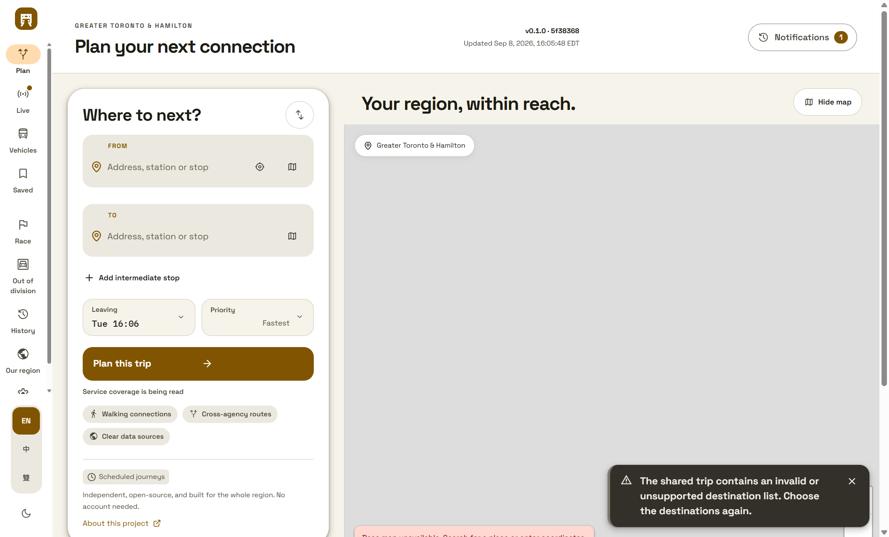

# Notifications

Anything the planner needs to tell you appears as a card in the bottom corner. It
never blocks the page, it never steals focus, and when it goes it is not gone: the
notification centre keeps it.

## What this replaced, and why

One `useState('')` in `app/page.tsx`, rendering one card on a 6.5 second timer. It
worked, and it had three problems that only appear when two things happen at once.

- **A second message replaced the first.** Saving a trip while a route request
  failed showed you exactly one of those, and never said which it dropped.
- **Everything left on the same timer.** An error you looked away from was gone.
- **Nothing was kept.** A message you half-read was unrecoverable.

## The stack

Cards stack upward in the corner, newest at the bottom, at most four at a time. The
stack itself does not take pointer events — only the cards do — so a notification
can never block the thing behind it.

| Kind | Leaves on its own |
| --- | --- |
| Information | after 6.5 seconds |
| Success | after 5 seconds |
| In progress | no |
| Warning | **no** |
| Error | **no** |

Warnings and errors stay until you dismiss them. A message telling you something
went wrong, which removes itself while you are reading the thing that went wrong,
has told you nothing and cost you the chance to find out.

The kind is carried by a glyph, a word and an edge colour together, so it is never
the colour alone that says an error is an error. Only an error is announced
assertively to a screen reader; anything else is polite, because a live region that
talks over what you were listening to is one people switch off.

A retry supersedes rather than stacks. Three attempts at one route request is one
story, not three cards.

## The centre

Everything that has appeared is in the centre, whether it was dismissed by hand or
timed out, up to the last hundred. It is a list, so it has what every list here has
to have:

- **Search**, using the planner's own matcher with the regular-expression builder
  beside it. Plain text is the default. See [the workbench](../search/regex-builder.md).
- **Filter by kind and by day.** A kind with nothing in it shows a zero rather than
  disappearing, so an empty result is visibly empty rather than mysteriously so.
- **Multi-select, with select-all saying which all it means.** "Select these 12"
  and "select every match" are different answers and the difference matters; a list
  showing twelve of nine hundred has two honest readings of select-all and they
  differ by 888 items.
- **A preview that separates what is selected from what will change.** A card still
  on screen is skipped, and the count says so rather than quietly acting on fewer
  than it claimed.
- **Export**, in eleven formats, honouring whatever filter is showing.

## Export

JSON, JSON Lines, CSV, TSV, YAML, TOML, XML, Markdown, HTML, SQL and JSON Schema.

A format that cannot carry the data **says so before it writes**, in the panel, not
afterwards in a file that looks complete. CSV cannot hold a nested value, so it is
told to you that one will become JSON text in a single cell. A schema is told to you
as describing the shape and containing none of the records. TOML has no null.

Values are escaped for the format they are written in: a comma, a quote or a
newline in a CSV cell is quoted, a pipe in a Markdown cell is escaped, an
apostrophe in a SQL string is doubled, and every HTML cell is escaped so an
exported value cannot become markup.

The filename carries the day so a folder of exports is orderable, and it cannot
contain a path separator.

## Forgetting

Dismissing is not destructive: the centre still has it. **Forgetting is**, and it
goes through the two-key gate.

Two keys turned independently, then a slider dragged its whole length. It is
deliberately awkward, because the action cannot be undone and a single confirm
button is a thing people press without reading. The slider does not move until both
keys are turned, and turning a key back off returns it to the start — leaving it
part-way would mean a second confirmation took half the deliberate effort of the
first.

Only a full sweep authorises. A threshold short of the end would let a fast drag
that overshot most of the way count as deliberate, which is the accident the
control exists to prevent. Authorising twice is authorising once: the disabled
button is the visible guard, and the state machine refuses an incomplete or
already-authorised sweep, which is the real one — a disabled button does not stop
a keyboard submit.

The gate always says what it is waiting for, because a disabled control with no
explanation reads as broken. The emergency exit is never disabled: somebody who
wants out of a destructive dialog gets out of it, and Escape reaches it too.

The sentence naming what will be destroyed is rendered plainly and is never styled
by the playfulness sliders. `describesTheAction` refuses a gate whose copy does not
name the thing: a confirmation that does not say what it is confirming is a
confirmation for a question nobody was asked, and ceremony around it fixes nothing.

## Persistence

The history is kept in this browser, bounded, through the same storage every other
preference uses. Nothing is sent anywhere.

**Restored rows keep no actions.** Their handlers did not survive the reload, and a
button that looks live and does nothing is the decorative-control defect this
project refuses everywhere else. The row still says an action was offered, and
offers none.

An unreadable stored history is dropped whole rather than partly restored, because
half a history looks complete. A malformed row inside a readable history is skipped
and the rows around it survive. Titles and bodies are clamped on the way back in, so
a stored blob cannot become the interface.

## Captured from the built artifact

Taken through the debugging protocol against an isolated browser on an off-screen
desktop, driving the document the production server serves. Both reach the state
the same way a person would: by opening a malformed shared link. The theme is
reached through the control a person would use, never by assigning the attribute
the application rewrites from its own state.

| | |
| --- | --- |
| Commit | `5f383682f46fd2cf8a461069203989d2a4dd7438` |
| Viewport | 1440 x 900, scale 1 |

| File | SHA-256 |
| --- | --- |
| `captures/notification-toast-1440-light.png` | `695a0f758d40b99c53f735af453ff9dff196d59ed1a165ed99495803ac52a2c7` |
| `captures/notification-centre-1440-dark.png` | `de430fb0b67da065af93b58124ebb3e0aabb240dead68875066f101d9da072e6` |

The first of these found a defect nothing else could. The opener was rendered
after the footer, which put the only way into the centre at the very bottom of the
document: every unit check passed, and the browser driver found it with a query
selector. A person could not see it. It is in the topline now, and the capture
script refuses to fire unless the opener is actually within the viewport.

## Verification

`tests/notifications.test.mjs`, `tests/super-confirm.test.mjs` and
`tests/bulk-export.test.mjs`, plus 24 checks against the running build through
`scripts/ui-evidence/drive-notifications.mjs`.

The driver reaches the gate the way a person would: by opening a malformed shared
link, which is a real path through the shell that refuses the destination list and
raises a warning. It confirms in a browser that the slider is inert on one key,
that a 90% drag still refuses, and that the emergency exit leaves without
destroying anything.

## What is not done

- The centre is reachable from its own control. It is not yet in the command
  palette, and the palette's own registry is where that belongs.
- Progress notifications have a severity and no producer yet: nothing in the
  planner currently reports long-running work this way.
- The captures cover 1440 in both themes. Narrow widths and higher display scales
  are unverified.
