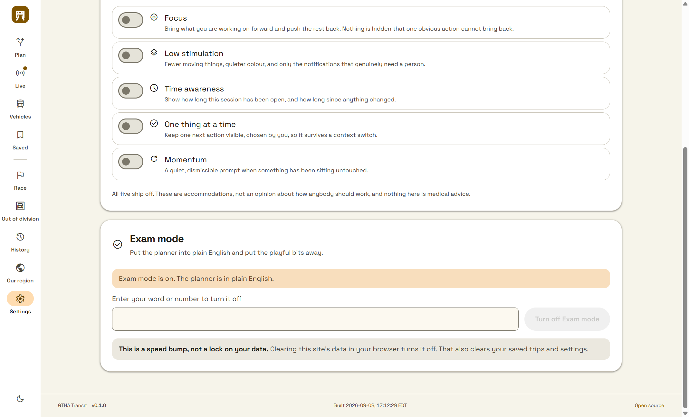
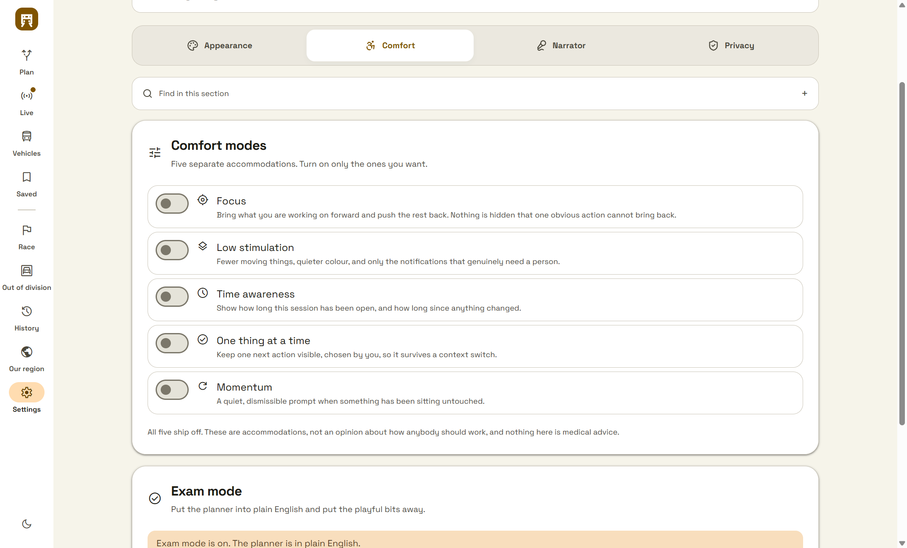

# School mode

Plain English, with the playful parts put away, behind a word only the person who
set it knows. It ships off and nothing turns it on but somebody choosing to.

## It omits; it does not disable

While the mode is on, five things behave as though they were never installed:

| | Where it goes from |
| --- | --- |
| Cantonese | The navigation language buttons, the settings Language tab |
| Both languages | The same two |
| Both playfulness sliders | The settings Language tab |
| Your own wording | The Comfort section |
| The dim sum surprise | It simply does not draw |

Not greyed out. A disabled switch still reads **Cantonese** to everybody who can
see the screen, which is precisely what somebody switching this on did not want.
The whole Language tab leaves the strip rather than staying empty, and somebody
who was sitting on that tab when the mode came on lands on Appearance rather than
on a tab that no longer exists.

`SUPPRESSED` in `lib/school-mode.ts` names all five in one list, so a new surface
has one place to ask and a reviewer has one place to read.

**And it leaves the settings search and the command palette at the same moment.**
`HIDDEN_BY_SCHOOL` in `lib/settings-catalog.ts` removes those rows from the one
registry both readers use. A row hidden in the workspace but left in the catalog
is a control the palette can still teleport straight to, which would make the
whole thing decorative.

## Nothing anybody chose is overwritten

The mode is *read through*, never written back:

```
shownLang  = effectiveLanguage(school, lang)
shownFunEn = effectiveFunLevel(school, funEn)
```

Somebody's Cantonese choice and their two playfulness levels sit untouched in
their own settings and come back the moment the mode goes off. A loaded wording
file is not cleared either — it is simply not applied, and it returns with its
card. Overwriting would turn a temporary mode into a permanent edit of somebody's
preferences, which is a far worse thing than the mode it was implementing.

## Renaming it takes the shipped name away

Somebody who calls it *Exam mode* gets that name in the card heading, the button,
the on-state line, the settings search result and the palette row. Nothing says
*School mode* again anywhere. A rename that leaked the original name in one
tooltip would defeat the rename entirely, so the test asserts the shipped name
appears nowhere in the catalog once a name has been chosen.

## It is a speed bump, not a lock on your data

Said in those words on the control itself, next to the field that sets it.

The credential is a PBKDF2-SHA256 hash at 210,000 iterations over a random
16-byte salt, in this browser's own storage. The word itself is never stored,
never logged, never exported and never in a capture. Two locks with the same word
store different hashes, because each is salted.

None of which makes it a protection, and the copy never says it is:

> **This is a speed bump, not a lock on your data.** Clearing this site's data in
> your browser turns it off. That also clears your saved trips and settings.

Anybody with the browser can clear site data. Forgetting the word is a normal
outcome for a lock somebody set on themselves, so the way out is written where
they set it rather than left to be discovered — and what it costs them is written
beside it, because a recovery route that quietly deletes their saved trips is not
a recovery route.

**A record that claims to be on with no credential restores as off.** That is the
one failure this must never have: being shut out of your own planner by a corrupt
storage record is not a speed bump, it is a wall.

## Where a contract cannot apply literally

The universal contract asks for one shared application-data record across every
app on a machine, propagating live, with the credential in the operating-system
vault. A browser has neither a shared application-data location nor a credential
vault, and cannot reach one.

The equivalent shipped here is honest about that rather than silently short: the
record is this origin's own `localStorage`, the credential is a salted hash in it,
and the recovery route is clearing site data — which is exactly the reset the
contract names, in the only store a browser has. What is genuinely not provided is
propagation to a sibling application, because there is no sibling application to
propagate to.

## It cannot be set without a secure connection, and it says so

`crypto.subtle` exists only in a secure context, so an origin served over plain
HTTP — a LAN address, a bare IP, anything but https or localhost — has no
WebCrypto and cannot derive the hash.

This was found by driving the deployed build, and it had been failing silently:
the button appeared to do nothing at all, because the promise rejected inside an
`onClick` where nothing catches it. Every unit test passed, because Node always
has WebCrypto.

The control now asks before it offers. Where the lock cannot be made, the reason
replaces the fields rather than sitting under a form that cannot be submitted —
a dead form reads as the person having got something wrong. Both the lock and
the unlock report a throw rather than swallowing it.

A lock that cannot be set is a fine outcome. A lock that appears to be set and is
not would be the dangerous one.

## Driven in the built artifact

`scripts/ui-evidence/drive-school-mode.mjs`, against the real built server through
an isolated browser proven to expose exactly one page target. **23 of 23 checks
pass.** It reaches the control the way a person does, sets a name and a word,
and then asks the running page what is actually there.

It found two defects that reading the source could not, beyond the WebCrypto one
above:

- **The palette could still reset a playfulness level the interface no longer
  offered anywhere.** The actions are a *second* registry beside the settings
  catalog, and filtering one of them is filtering half. That teleport past a
  hidden control is precisely the thing this design exists to close, and the
  source guards were blind to it because each file was individually correct.
- **The honesty guard had stopped guarding.** Narrowing it went through a script
  that turned every `` into a literal backspace character, so the pattern
  matched nothing and the module could have claimed to encrypt somebody's data
  with the test still green.

### Captured from the built artifact

| | |
| --- | --- |
| Commit | `e945c9a2dd67eebaa70ffd7a1c01d3c2357da459` |
| Viewport | 1440 x 900, scale 1, light theme |
| Reached | Through the navigation and the Comfort tab, named *Exam mode*, locked with a word |



*SHA-256 `189154f6a59fb9e977dd6561cff2911b2ed716a923508f3f3ee3a33f954897b0`*

The heading says **Exam mode**, not the shipped name, and the shipped name appears
nowhere on the page. The rail down the left has no language buttons on it at all.



*SHA-256 `16af9a39e717eace3766199027927418466b4e52ced970dae65d3513c8665958`*

Four tabs, not five. The Language tab is gone rather than empty, and the wording
card is gone from Comfort rather than disabled.

## Verification

`tests/school-mode.test.mjs` — 26 tests over the lock, the name, the suppression
list, persistence, and the omission at every surface.

**Twenty-four boundaries were broken on purpose and watched go red**, then restored
and watched go green: the catalog filter removed; a row dropped off
`HIDDEN_BY_SCHOOL`; the row's label pinned to the shipped name; the Language tab
and its panel left in the strip; the stored-tab fallback removed; the navigation
language buttons and the wording card left rendered; `shownLang` reading the raw
setting; the replacer applied under the mode; dim sum unsuppressed; the salt made
constant; the playfulness override removed; the orphan-record guard removed; the
recovery line taken off the control; and a secret field left in the clear.

Two of those seventeen passed on the first attempt and were fixed rather than
accepted:

- **Looping over `HIDDEN_BY_SCHOOL`** meant shortening the list simply checked
  fewer things. A guard shaped that way catches a row done wrongly and never a row
  taken off the list. It now asserts the exact expected four.
- **Matching `type="password"` once** passed while the *other* secret field was in
  the clear. It now counts both.

Two existing guards also caught this change and were updated rather than
loosened: the one pinning the replacer's position inside `t`, and the one pinning
dim sum's suppression expression.

## What is not done

- The captures cover 1440 in the light theme. Narrow widths, the dark theme and
  higher display scales are unverified.
- On an origin without a secure connection the mode cannot be turned on. That is
  a browser constraint rather than a choice, it is stated on the control, and the
  planner is otherwise unaffected.
