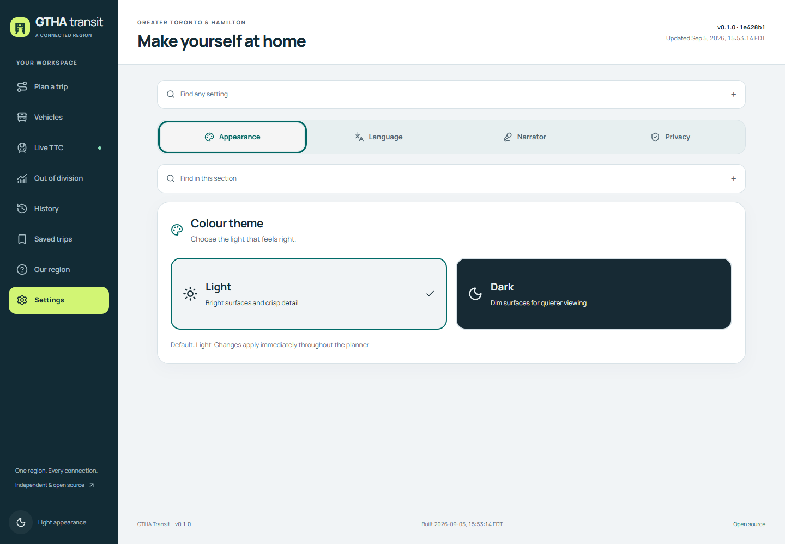

# Settings workspace

Settings has four sections: Appearance, Language, Narrator and Privacy. The selected section is kept in the browser under `gtha-settings-section-v1`. The tabs use the existing accessible tab primitive, with arrow-key navigation, labelled panels and a responsive strip. Changing sections does not recreate the planner's narration controller.

Appearance offers explicit Light and Dark choices. Language offers English, Hong Kong Cantonese and bilingual presentation, followed by separate English and Cantonese playfulness sliders. Each slider keeps its five-level preview and can reset independently to the shipped level 5. Narration retains its own language, English and Cantonese voice choices, rate, pitch, quiet mode and preview. It remains off by default. Privacy explains local preferences, routing requests, explicit sharing and independent service data.

The existing `gtha-preferences` record remains owned by the planner and retains vehicle criteria, vehicle options and division preferences. This reorganization never replaces that record with a smaller settings-only object. Narrator settings retain their separate existing browser record. If the section preference cannot be saved, the interface reports that limitation while remaining usable for the current session.

## Find an exact setting

The collapsed Find any setting control searches across all four sections. Each section also has its own collapsed Find in this section search. Each field has independent text/pattern/flag state and its own adjacent compact star opening the full regex workbench. Search includes option labels, descriptions, stable neutral identifiers and available current values. Query evaluation stays local.

Selecting a result opens its section, reveals any enclosing disclosure, scrolls to the exact control and focuses it. It does not silently enable narration or change another preference. If that target is disabled, the surrounding control group and the reason are shown. The narrator is rendered once, including when reached through search, so voice choices do not acquire duplicate identifiers or radio groups.

## Verification and boundaries

This unedited 1440 by 1000 Appearance capture is bound to `1e428b1`, its exact served bundle, recorded capture times and reviewed privacy/interaction receipts. It shows the current tab and both theme choices. The separate recorded interactions establish behavior beyond the still image.

At `e0ea605`, real browser interaction verified all four tabs by pointer and keyboard, both themes, independent English level 2 and Cantonese level 3 changes, bilingual mode, and persistence after reload. Global search for Rate opened the Narrator panel, expanded its voice options and focused the disabled voice-tuning group with an explanation. The run exposed a stale explanation after narration was enabled and two unnamed tuning sliders.

The `1e428b1` correction run verified that enabling narration immediately removes the stale notice, selecting the Rate search result focuses its actual range control, and the accessibility tree names the sliders Rate and Pitch. Repeated visual headings are removed while accessible legends remain. All five final desktop/320px light/dark and narrator captures passed the version-1 audit validator, with no unnamed interactive controls, horizontal body overflow, runtime exceptions or console errors in the recorded checks. Browser emulation does not establish physical touch or spoken-audio behavior, and the complete language/zoom matrix remains outstanding.

Suggested articles: [workspace navigation](workspaces.md), [spoken narrator](../accessibility/narrator.md), [search workbench](../search/regex-builder.md), [vehicle preferences](../planning/vehicle-preferences.md).
